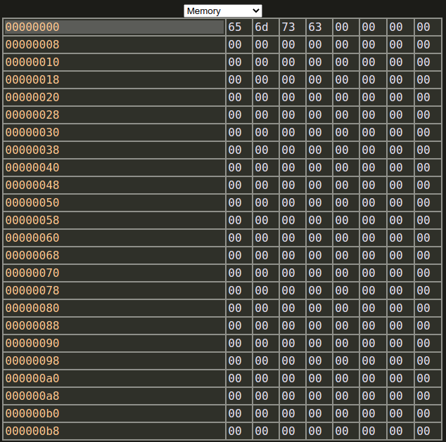

# CARVE Help Page

This is the help page for [CARVE](..), the _**C**ade **A**nd-greg **R**isc-**V** **E**mulator_. The source code is available [for free on GitHub](https://github.com/ChemicalDevelopment/CARVE).

## Basic Layout

## Text Editor

You can edit text in the text editor. Write RISC-V assembly, then click the 'run' button below the text editor to assemble and run the program.

## Output Console

You can view the output of the assembling process, as well as the execution process in the output console, which is located underneath the text input. You can click the output console to activate the block cursor, at which point you can type on your keyboard to input text.

  * Normal white text is standard output
  * Red-tinted text is standard error
  * Blue-tinted text is standard input
  * Orange-tinted text is debug messages

## Register View

You can view registers in the register view, which has a few columns (and 1 row per register):

  * `REG`: The base ID of the register. For integer registers, this is `x` and then the number
  * `NAME`: The typical human-readable name used for the register
  * `HEX`: The value of the register in hex (base-16), zero padded. This way you can inspect all bytes
  * `DEC`: The value of the register in decimal (base-10)

## Memory Explorer

You can change the register view tab to a memory explorer by changing the dropdown selection at the top (which defaults to `Int Registers`) to `Memory`. This will show a table of the memory of your program:

The first column is the address, and all other columns on the right are the byte values that come at and after that address. Both the addresses and the byte values are in hex, and each row has 8 bytes (thus, each row's starting address increases by 8).

The first column in the first row (defaulting to `00000000`) is the start address. That field is editable, so just click on that table cell and edit it to whatever hex address you'd like. When you hit `Enter`/`Submit`, the memory table will refresh with the memory starting at the address you entered. For example:

_Last updated 2021-04-29_
